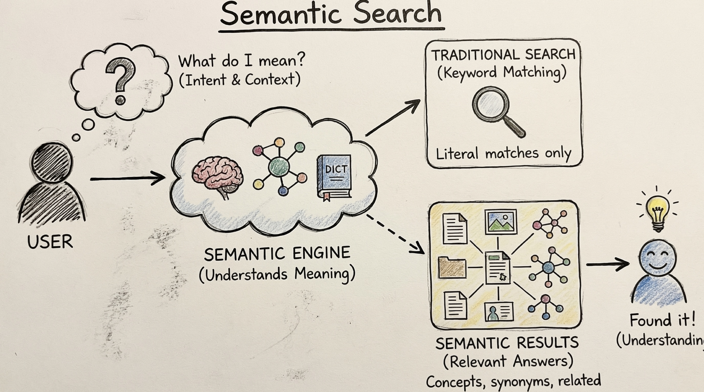

# Architecture

`justatom` separates retrieval composition from training and command-line
orchestration. A retrieval application owns concrete dependencies and passes
them to one `RetrievalRuntime`:

```text
DocumentStore + Embedder -> RetrievalRuntime -> Indexer + Retriever
```

The runtime creates an `Indexer` for writes and a mode-specific `Retriever` for
`keyword`, `vector`, or `hybrid` reads. It is an async context manager and owns
closing the supplied store and embedder.



## Packages

### `justatom.retrieval`

The retrieval contracts and runtime live here. `DocumentStore`, `Embedder`,
`Indexer`, `Retriever`, and `RetrievalRuntime` keep storage, embedding, and
search responsibilities explicit. `build_runtime` is the config composition
root and validates the retrieval schema before creating backend objects.

### `justatom.storing`

Backend-facing persistence lives here. `WeaviateDocumentStore` is the async
Weaviate implementation used by the runtime.

### `justatom.api`

Thin entrypoints for evaluation, training, and serving. The evaluator overlays
explicit retrieval command-line flags onto scenario configuration before calling
the runtime builder.

### `justatom.training`

Training remains separate from retrieval. Its public variants are `vanilla`,
`atom_gate`, and `atomic`; trained checkpoints can later be selected as an
embedding model during evaluation.

### `configs`

Scenario configuration for training, evaluation, and datasets. Evaluation
contains a strict `retrieval` mapping plus dataset, indexing, search, metric,
and output settings. See the [Launch Guide](launch-guide.md) for the current
shape.
