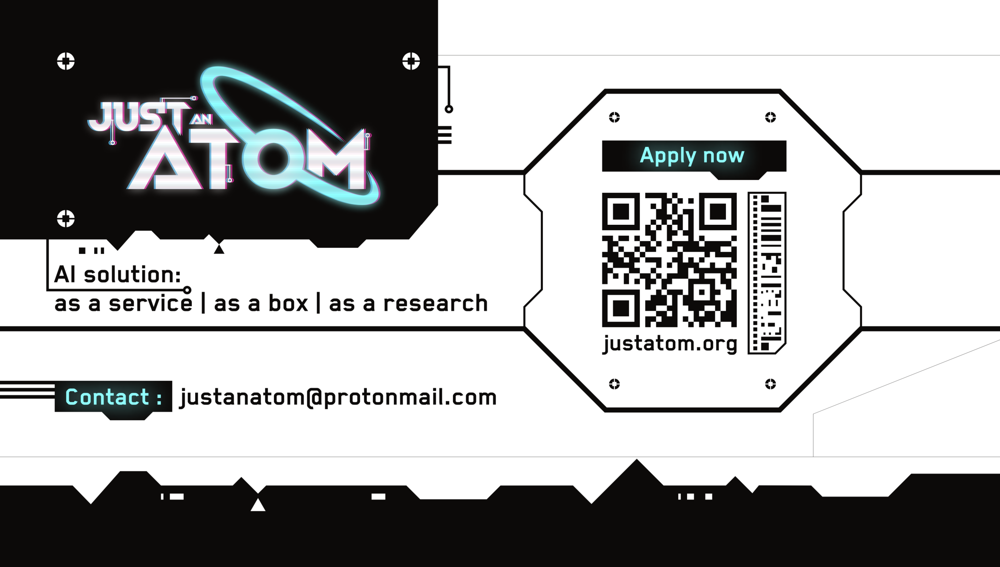

<div class="hero">
  <div class="hero-copy">
    <p class="eyebrow">Neural Retrieval Toolkit</p>
    <h1>Build retrieval systems that feel like products, not scripts.</h1>
    <p class="lead">
      justatom packages retrieval, embedding pipelines, evaluation flows, and scenario-driven training into one Python toolkit.
      Use it for local experiments, benchmark runs, or production-shaped indexing pipelines.
    </p>
    <p class="hero-actions">
      <a class="md-button md-button--primary" href="getting-started/">Get Started</a>
      <a class="md-button" href="launch-guide/">Open Launch Guide</a>
      <a class="md-button" href="#get-in-touch">Get in touch</a>
    </p>
  </div>
  <div class="hero-card">
    
    <p><strong>What you get</strong></p>
    <ul>
      <li>Scenario-based train and eval commands</li>
      <li>Dataset adapters for json, jsonl, parquet, csv, xlsx</li>
      <li>Embedding, indexing, retrieval, and metrics in one repo</li>
      <li>Notebook-friendly workflows plus CI-friendly CLI entrypoints</li>
    </ul>
  </div>
</div>

## Why justatom

Traditional lexical search is fast, but modern retrieval stacks need more than BM25 and a shell script. `justatom` is built for teams that want to move between experiments, evaluation, and deployment-style indexing without rewriting the whole pipeline each time.

<div class="feature-grid">
  <div class="feature-tile">
    <h3>Scenario first</h3>
    <p>Train and evaluate from YAML configs, then override specific values from the CLI when you need quick iteration.</p>
  </div>
  <div class="feature-tile">
    <h3>Data ready</h3>
    <p>Normalize raw datasets into a canonical document schema and keep extra metadata intact for downstream logic.</p>
  </div>
  <div class="feature-tile">
    <h3>Production-shaped</h3>
    <p>Repository structure already separates API entrypoints, running pipelines, storing layers, and training code.</p>
  </div>
</div>

## Fast Path

=== "Install"

    ```bash
    pip install -e .
    pip install -r requirements-docs.txt
    ```

=== "Run Tests"

    ```bash
    pytest tests -m "not integration"
    ```

=== "Serve Docs"

    ```bash
    make docs-serve
    ```

## Visual Overview


## Core Building Blocks

- `justatom.api.*`: command-line entrypoints for training, evaluation, and runtime helpers.
- `justatom.running.*`: orchestration layer for retrievers, evaluators, trainers, and services.
- `justatom.processing.*`: dataset loading, tokenization, sampling, and preprocessing helpers.
- `justatom.storing.*`: dataset persistence and vector-store related integrations.
- `configs/*.yaml`: scenario configs that define how experiments should run.

## Module Guides

<div class="feature-grid module-grid">
  <div class="feature-tile">
    <h3><a href="modules/api-cli/">API CLI</a></h3>
    <p>Command entrypoints for training, evaluation, and runtime launches.</p>
  </div>
  <div class="feature-tile">
    <h3><a href="modules/runtime/">Runtime</a></h3>
    <p>Retrievers, evaluators, trainers, services, embeddings, and orchestration logic.</p>
  </div>
  <div class="feature-tile">
    <h3><a href="modules/data-processing/">Data Processing</a></h3>
    <p>Loaders, tokenization, silos, and sampling utilities for repeatable pipelines.</p>
  </div>
  <div class="feature-tile">
    <h3><a href="modules/storage/">Storage</a></h3>
    <p>Dataset persistence and Weaviate-facing integrations.</p>
  </div>
  <div class="feature-tile">
    <h3><a href="modules/modeling/">Modeling</a></h3>
    <p>Metrics, numeric utilities, model heads, and core lower-level abstractions.</p>
  </div>
</div>

## Get in touch

<div class="contact-band" id="get-in-touch">
  <div class="contact-copy">
    <p class="eyebrow">Get in touch</p>
    <h2>Talk to the maintainer, share feedback, or show what you built with justatom.</h2>
    <p>
      If you are experimenting with retrieval, building a production search stack, or want to discuss collaboration,
      the fastest route is one of the channels below.
    </p>
  </div>
  <div class="contact-card">
    
    <ul>
      <li><a href="https://www.linkedin.com/in/itarlinskiy/">LinkedIn</a></li>
      <li><a href="https://t.me/itarlinskiy">Telegram</a></li>
      <li><a href="https://vk.com/itarlinskiy">VK</a></li>
      <li><a href="https://github.com/atomicai/justatom">GitHub repository</a></li>
      <li><a href="https://justatom.ai">justatom.ai</a></li>
    </ul>
  </div>
</div>

## Read Next

- Start with [Getting Started](getting-started.md) for install and local commands.
- Continue with [Launch Guide](launch-guide.md) for scenario configs and dataset presets.
- Open [Architecture](architecture.md) for a repo-level map.
